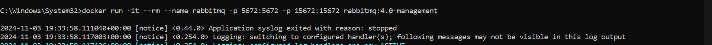
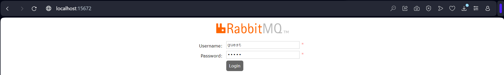
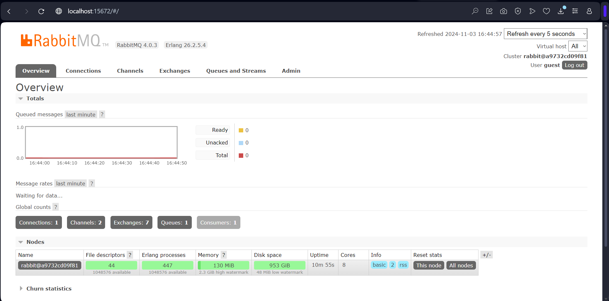
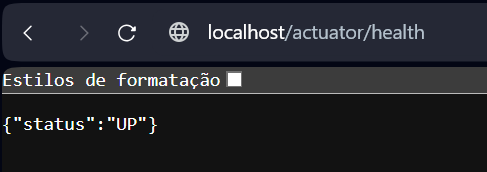
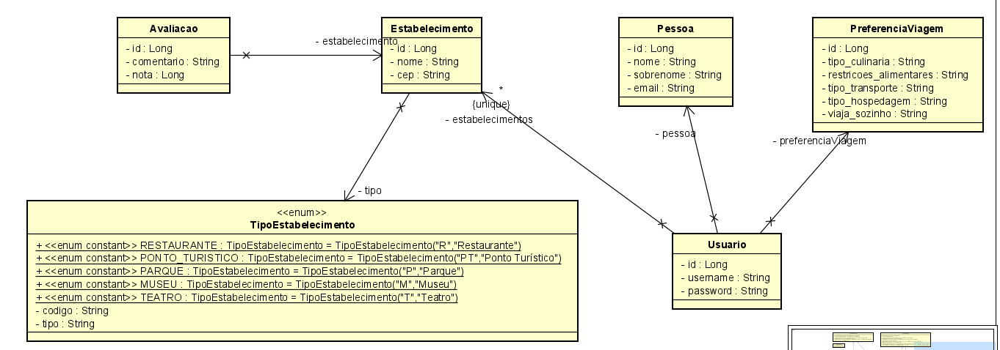
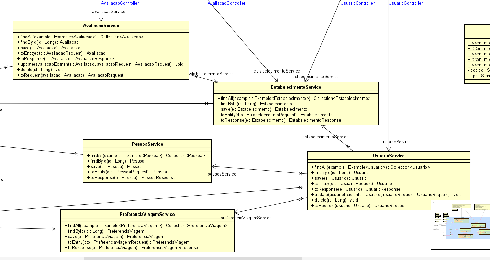
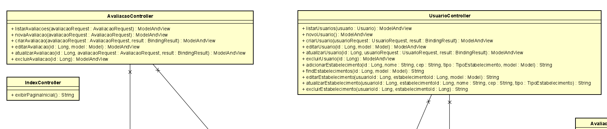
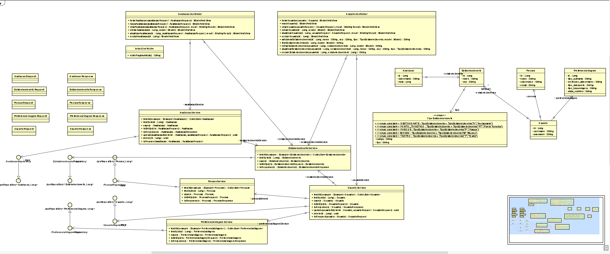

# TechPeach: Planejamento de Viagens Personalizadas com IA


**TechPeach** é uma plataforma web que permite aos usuários organizar e compartilhar seus locais favoritos em São Paulo. Com uma interface intuitiva e dinâmica, o TechPeach facilita o planejamento de viagens e a descoberta de novos pontos de interesse na cidade.

## Integrantes

* **Allesson Augusto (RM99533):** Compliance & Quality Assurance
* **Cauã Mongs (RM552178):** Advanced Business Development with .NET
* **Erik Teixeira (RM551377):** Disruptive Architectures: IOT, IOB & Generative IA e Java Advanced
* **Guilherme Naoki (RM551456):** Mastering Relational and Non-Relational Database
* **Leonardo Gonçalves (RM98912):** DevOps Tools e Cloud Computing

**Contribuições em Equipe:**
* Mobile App Development: Todo o grupo colaborou.


## Rodando a Aplicação

**Pré-requisitos:**

* Java JDK 8 ou superior
* Maven
* Banco de dados (ex: MySQL, PostgreSQL)
* Execute o RabbitMQ com Docker
* Chave de API do Google Cloud (para Gemini)

**Passos:**

1. **Clone o Repositório:**
   ```bash
   git clone https://github.com/ErikTeixeira/java_challenge_.git

2. **Configure o Banco de Dados:**
    * Crie um banco de dados e atualize as configurações de conexão no arquivo application.properties.

3. **Construa a Aplicação:**
    ```bash
    mvn clean package

4. **Execute a Aplicaçãos:**
    ```bash
   java -jar target/TechPeach.jar

5. **Execute o RabbitMQ com Docker:**
    ```bash
    docker run -it --rm --name rabbitmq -p 5672:5672 -p 15672:15672 rabbitmq:4.0-management



<br>
*   Acesse o RabbitMQ Management no endereço: http://localhost:15672


<br>

6. **Execute a Aplicaçãos:**
    * A aplicação estará disponível em http://localhost/
    <br>

7. **Verifique o Status da Aplicação com Actuator:**
    * O Spring Actuator está configurado para monitoramento. Acesse o endpoint de saúde em:
    ```bash
    http://localhost:8080/actuator/health




Para rodar os comandos acima no Windows, você pode usar o Prompt de Comando ou o PowerShell:

1. Abra o Prompt de Comando ou PowerShell.
2. Navegue até o diretório onde você clonou o repositório.
3. Execute os comandos conforme indicado nos passos acima.

Certifique-se de que o Maven e o Java estão corretamente instalados e configurados no seu PATH do Windows.


## Diagramas

**Diagrama da entity da Sprint:**
    
    
**Diagrama service da Sprint:**
    

**Diagrama da controller da Sprint:**
    

**Diagrama da Sprint:**
    


## Vídeo da Proposta Tecnológica

**Link da Sprint 3:**
    * https://youtu.be/lV95820MN6k
**Link da Sprint 2:**
    * https://youtu.be/JiGy_ohObWo

**Link da Sprint 1:**
    * https://youtu.be/0c4opnXL8fU


## Descrição do Problema e Solução

### Problema
Planejar viagens pode ser um processo tedioso e desafiador, especialmente para encontrar atividades e locais que se alinhem com as preferências individuais dos viajantes.

## Tecnologias Utilizadas

* **Backend:** Java, Spring Boot, Spring Security, Spring Data JPA, Spring AMQP (RabbitMQ), Spring Boot Actuator
* **Frontend:** Thymeleaf, HTML, CSS, JavaScript, Bootstrap
* **Banco de Dados:** Oracle SQL
* **IA:** Google Gemini API
* **Mensageria:** RabbitMQ
* **Containerização:** Docker

### Solução
O TechPeach oferece uma plataforma online onde os usuários podem:
- Cadastrar seus locais favoritos em São Paulo, com informações detalhadas como endereço, horário de funcionamento, fotos e avaliações.
- Organizar os locais em listas personalizadas, facilitando o planejamento de roteiros.
- Compartilhar as listas com amigos e familiares, permitindo a colaboração na organização da viagem.

### Público-Alvo
Viajantes e turistas que buscam uma experiência de viagem personalizada e memorável.

### Benefícios
- **Experiências Autênticas:** Conecta viajantes a atividades e locais que realmente os inspirem.
- **Planejamento Simplificado:** Facilita o processo de planejamento de viagens.
- **Personalização:** Cria itinerários sob medida adaptados às preferências dos usuários.
- **Ofertas Exclusivas:** Oferece ofertas especiais em parceria com estabelecimentos locais.

Com o TechPeach, os viajantes podem descobrir e reservar atividades personalizadas, tornando suas viagens mais memoráveis e autênticas!

